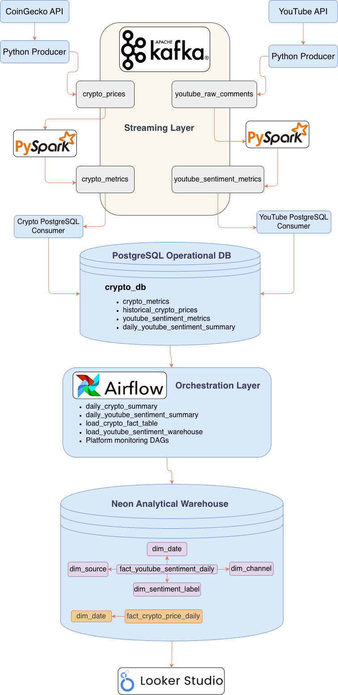
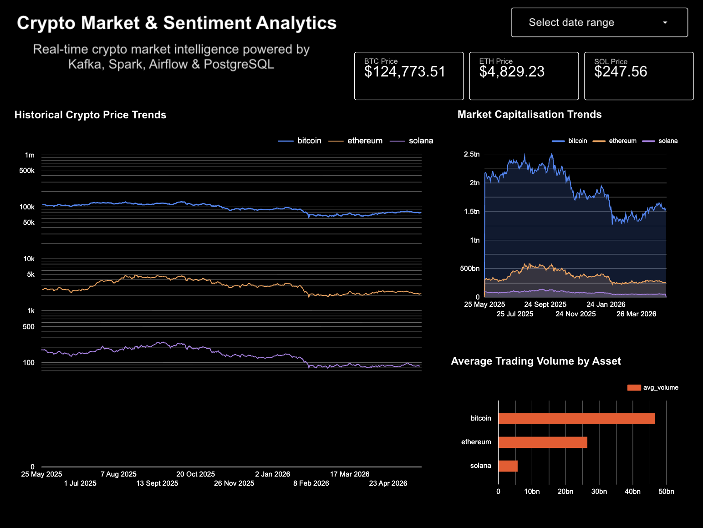
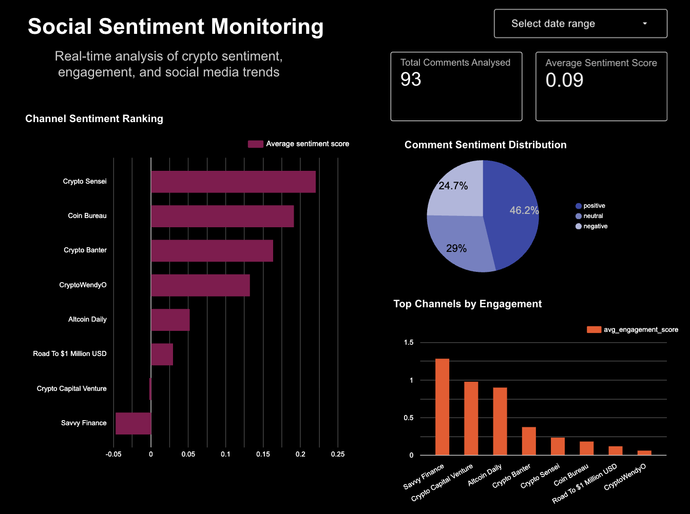
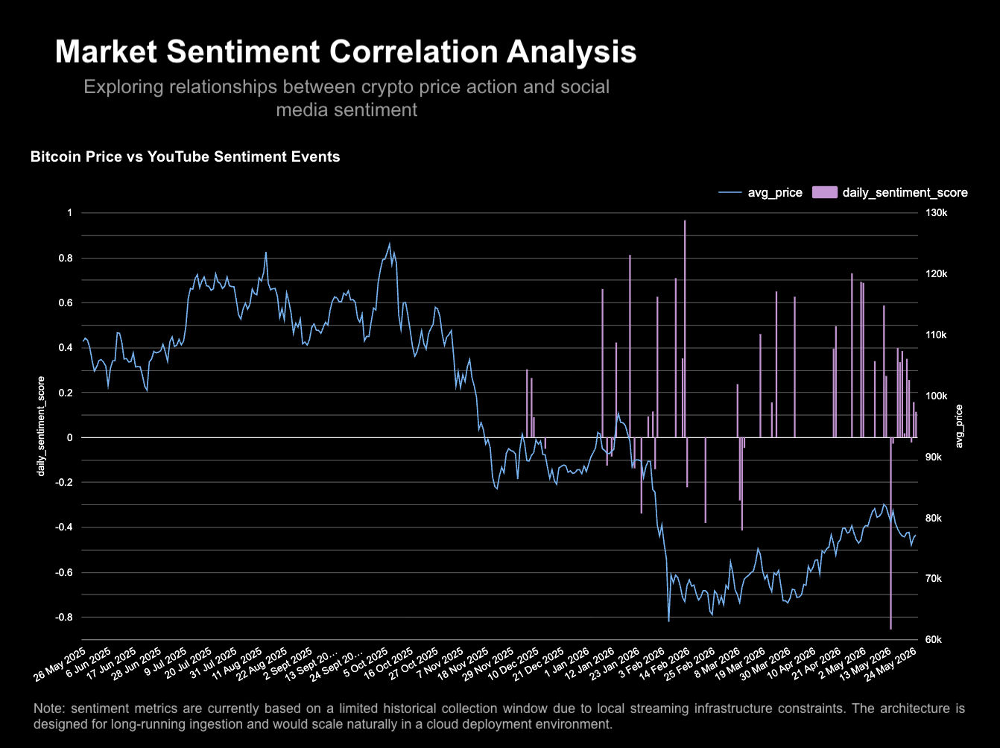
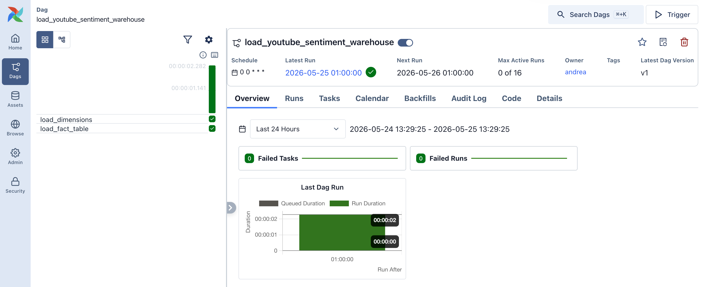
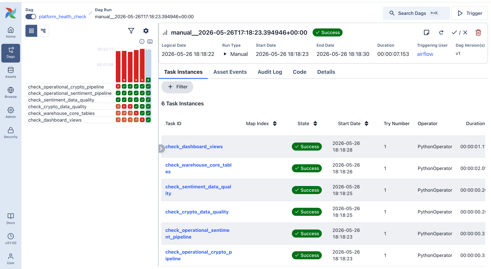
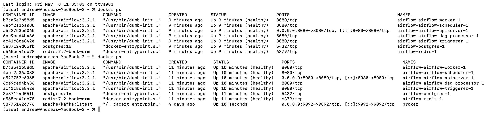

# Crypto Streaming Analytics Platform

## Overview

A real-time cryptocurrency analytics platform built using Kafka, PySpark, PostgreSQL, Airflow, Neon PostgreSQL, and Looker Studio.

The platform ingests live cryptocurrency market data alongside cryptocurrency-related YouTube sentiment data, processes both streams in real time, stores operational outputs in PostgreSQL, loads analytical aggregates into a cloud warehouse, and exposes business-facing insights through interactive dashboards.

The project evolved from a simple streaming pipeline into a complete analytics platform incorporating:

* real-time event streaming
* distributed stream processing
* sentiment analysis
* dimensional warehousing
* Airflow orchestration
* monitoring and observability
* analytical dashboarding

---

# System Architecture



---

# Documentation

Detailed project documentation is available in:

* `docs/architecture.md`
* `docs/warehouse_design.md`
* `docs/dashboard_walkthrough.md`
* `docs/monitoring_architecture.md`

---

# Tech Stack

## Streaming & Processing

* Apache Kafka
* PySpark Structured Streaming
* Python

## Operational Storage

* PostgreSQL

## Analytical Warehouse

* Neon PostgreSQL

## Orchestration & Monitoring

* Apache Airflow
* Docker Compose

## Analytics & BI

* Google Looker Studio

## Data Sources

* CoinGecko API
* YouTube Data API

---

# Platform Architecture

## Cryptocurrency Market Pipeline

```text
CoinGecko API
        ↓
Python Kafka Producer
        ↓
Kafka Topic: crypto_prices
        ↓
PySpark Structured Streaming
        ↓
Kafka Topic: crypto_metrics
        ↓
Python PostgreSQL Consumer
        ↓
PostgreSQL Operational Database
```

## YouTube Sentiment Pipeline

```text
YouTube Data API
        ↓
Python Kafka Producer
        ↓
Kafka Topic: youtube_raw_comments
        ↓
PySpark Structured Streaming
        ↓
Kafka Topic: youtube_sentiment_metrics
        ↓
Python PostgreSQL Consumer
        ↓
PostgreSQL Operational Database
```

## Analytical Warehouse

Operational PostgreSQL data is transformed into a dimensional warehouse model hosted in Neon PostgreSQL.

The warehouse contains:

* fact tables
* dimension tables
* analytical views
* aggregated sentiment metrics
* historical crypto pricing data

---

# Dashboard Outputs

## Cryptocurrency Market Analytics



Provides:

* cryptocurrency price tracking
* historical trend analysis
* market capitalisation monitoring
* trading volume analysis
* interactive asset filtering

---

## Social Sentiment Monitoring



Provides:

* sentiment distribution analysis
* engagement monitoring
* creator sentiment ranking
* weighted sentiment scoring
* channel-level sentiment insights

---

## Market Sentiment Correlation



Provides:

* sentiment event tracking
* Bitcoin price comparison
* sentiment trend monitoring
* exploratory market correlation analysis

---

# Airflow Orchestration

## Warehouse Loading



Airflow orchestrates:

* warehouse loading workflows
* analytical aggregations
* scheduled refreshes
* dependency management

---

## Platform Monitoring



The monitoring layer validates:

* streaming freshness
* Spark processing completion
* operational PostgreSQL writes
* warehouse population
* dashboard readiness
* data quality rules
* analytical integrity

---

# Warehouse Design

## Star Schema


The analytical warehouse follows a simplified star schema design consisting of:

### Fact Tables

* `fact_crypto_price_daily`
* `fact_youtube_sentiment_daily`

### Dimension Tables

* `dim_date`
* `dim_source`
* `dim_channel`
* `dim_sentiment_label`

---

# Docker Infrastructure



The platform is containerised using Docker Compose.

Core services include:

* Kafka
* Spark
* PostgreSQL
* Airflow
* Redis

---

# Repository Structure

```text
crypto-streaming-pipeline/
│
├── airflow/
├── crypto_market_stream/
├── sentiment-stream/
├── sql/
├── scripts/
├── docs/
├── images/
├── requirements.txt
└── README.md
```

---

# Engineering Highlights

## Streaming & Processing

- Kafka producers and consumers
- Spark Structured Streaming
- window aggregations
- micro-batching
- checkpointing

## Data Engineering & Modelling

- ELT workflow design
- dimensional warehouse modelling
- star schema design
- analytical aggregations
- operational vs analytical storage separation

## Infrastructure & Orchestration

- Airflow DAG development
- workflow dependency management
- scheduled warehouse refreshes
- Docker Compose deployment

## Monitoring & Reliability

- platform health checks
- data freshness validation
- data quality monitoring
- warehouse integrity validation
- dashboard readiness checks

---

# Challenges & Debugging

Key engineering challenges encountered during development included:

* Spark Kafka connector compatibility
* Airflow Docker environment propagation
* warehouse connectivity debugging
* schema mismatches
* streaming latency handling
* monitoring DAG parsing
* dashboard validation

Detailed debugging notes are available in:

```text
docs/debugging_notes/
```

---

# Future Improvements

Potential future enhancements include:

* automated alerting
* anomaly detection
* dbt integration
* CI/CD deployment
* cloud infrastructure deployment
* lower-latency dashboard refreshes
* additional sentiment sources
* advanced NLP models

---

# Summary

This project demonstrates an end-to-end data engineering platform integrating real-time streaming, sentiment analytics, warehousing, orchestration, monitoring and dashboard reporting.

The platform combines Kafka, Spark, PostgreSQL, Airflow, Neon and Looker Studio to transform raw market and social data into analytical insights and business-facing visualisations.
