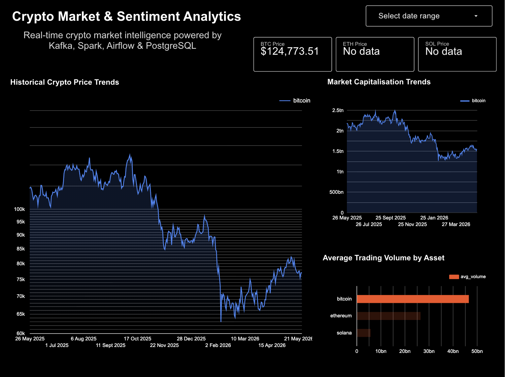
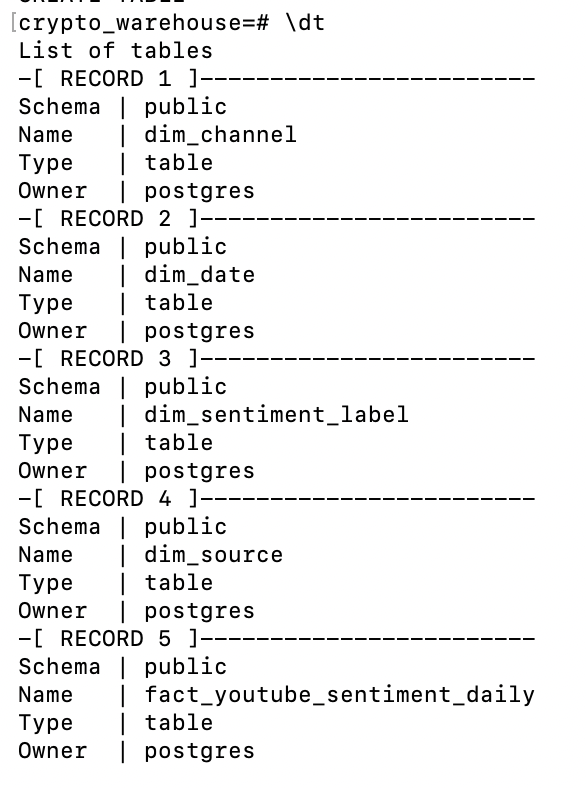
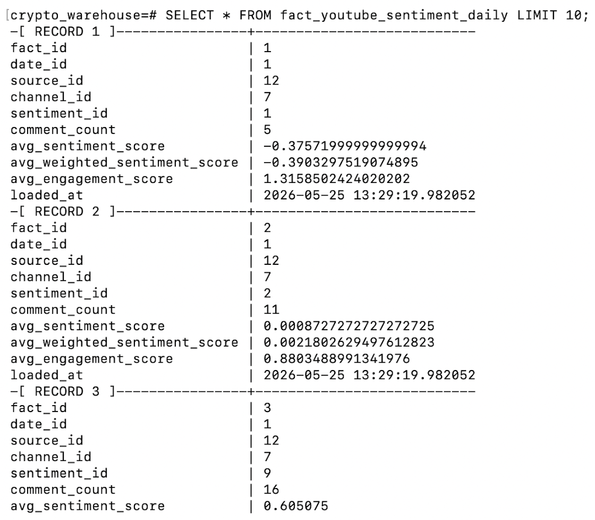
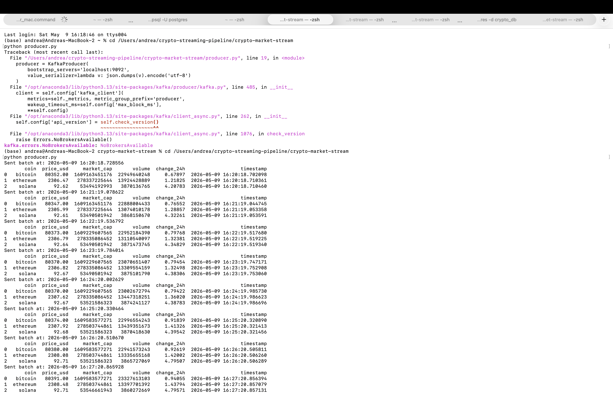
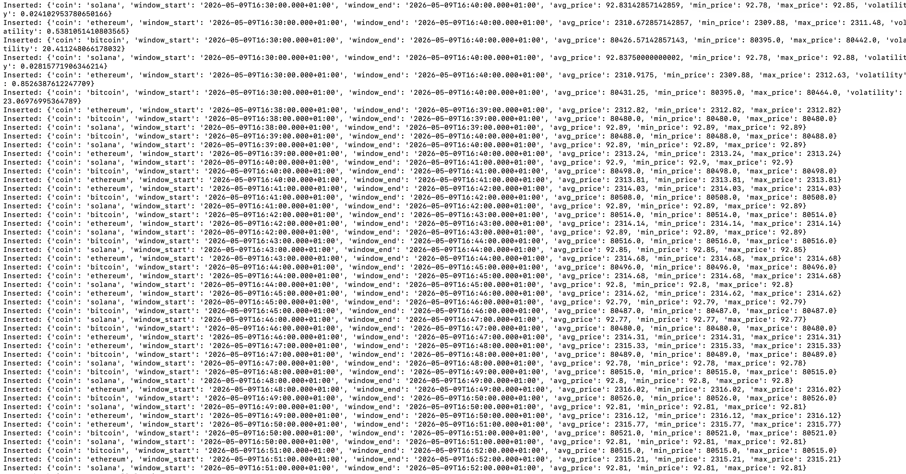
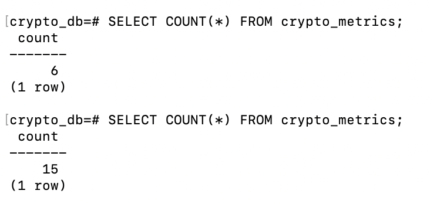
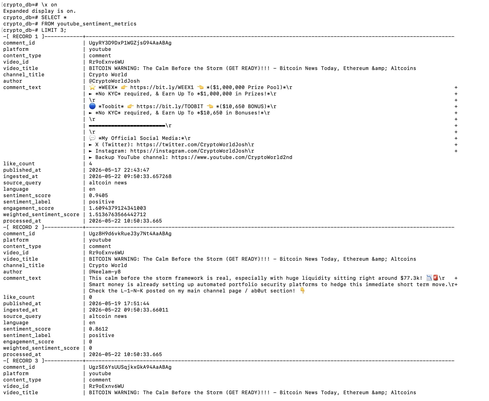

# Crypto Streaming Analytics Platform

## Overview

A real-time crypto analytics platform built with Kafka, PySpark, PostgreSQL, Airflow, and Neon PostgreSQL.

The platform ingests live cryptocurrency market data and YouTube crypto sentiment data, processes both streams in real time, stores operational data in PostgreSQL, loads analytical aggregates into a dimensional warehouse, and powers dashboard-ready analytical views.

The project evolved from a simple streaming pipeline into a production-style analytics platform with:

- real-time streaming ingestion
- Spark Structured Streaming transformations
- sentiment analysis pipelines
- dimensional warehouse modelling
- Airflow orchestration
- platform monitoring and observability
- dashboard-ready analytical views
- operational health checks

---

# System Architecture


---

# Tech Stack

## Streaming & Processing

- Apache Kafka
- PySpark Structured Streaming
- Python

## Databases

### Operational Layer

- PostgreSQL

### Analytical Warehouse

- Neon PostgreSQL

## Orchestration & Monitoring

- Apache Airflow
- Docker Compose

## Analytics & BI

- Google Looker Studio

## APIs & Data Sources

- CoinGecko API
- YouTube Data API

---

# Platform Architecture

## Crypto Market Pipeline

```text
CoinGecko API
        ↓
Python Kafka Producer
        ↓
Kafka Topic: crypto_prices
        ↓
PySpark Structured Streaming
        ↓
Kafka Topic: crypto_metrics
        ↓
Python PostgreSQL Consumer
        ↓
PostgreSQL Operational Database
```

## YouTube Sentiment Pipeline

```text
YouTube Data API
        ↓
Python Kafka Producer
        ↓
Kafka Topic: youtube_comments
        ↓
PySpark Structured Streaming
        ↓
Kafka Topic: youtube_sentiment_metrics
        ↓
Python PostgreSQL Consumer
        ↓
PostgreSQL Operational Database
```

---

## Warehouse Layer

Operational PostgreSQL data is transformed into a dimensional warehouse model hosted in Neon PostgreSQL.

The warehouse contains:

- fact tables
- dimension tables
- dashboard-ready analytical views
- aggregated sentiment metrics
- historical crypto pricing data

---

# Dashboard Outputs

## Crypto Market Dashboard


---

## Sentiment Monitoring Dashboard


---

## Market Correlation Dashboard


---

# Dashboard Features

The dashboards provide:

- cryptocurrency price tracking
- rolling volatility monitoring
- sentiment distribution analysis
- weighted sentiment scoring
- engagement-based sentiment metrics
- cross-market sentiment comparison
- dashboard filtering by cryptocurrency

Example dashboard filtering:



---

# Airflow Orchestration

## Warehouse DAG

Airflow orchestrates warehouse loading operations.


The warehouse DAG:

- loads dimension tables
- loads aggregated fact tables
- orchestrates daily warehouse refreshes
- validates analytical dependencies

---

# Monitoring & Observability

A platform-wide monitoring DAG validates the health of the analytics stack.


The monitoring layer validates:

- streaming ingestion freshness
- Spark processing completion
- operational PostgreSQL writes
- warehouse table population
- dashboard view readiness
- data quality rules
- analytical integrity

This monitoring architecture significantly improved the operational realism of the project.

Detailed monitoring documentation:

```text
docs/monitoring_architecture.md
```

---

# Warehouse Design

## Star Schema Design


---

## Warehouse Implementation

Actual PostgreSQL warehouse schema:



---

## Example Analytical Fact Table

Example analytical warehouse output:



The warehouse stores:

- aggregated sentiment metrics
- weighted engagement scores
- daily crypto pricing summaries
- dimensional joins for BI analysis
- historical analytical data

---

# Streaming & Operational Outputs

## Kafka Streaming Output



---

## PostgreSQL Live Inserts



---

## PostgreSQL Row Growth Monitoring



---

## Sentiment PostgreSQL Output



---

# Docker Infrastructure

The platform is containerised using Docker Compose.


The Docker infrastructure includes:

- Airflow services
- PostgreSQL
- Redis
- Kafka
- Spark dependencies

---

# Repository Structure

```text
crypto-streaming-pipeline/
│
├── README.md
├── requirements.txt
├── LICENSE
├── .gitignore
│
├── airflow/
│   ├── dags/
│   │   ├── crypto_pipeline_health_check.py
│   │   ├── platform_health_check.py
│   │   ├── load_youtube_sentiment_warehouse.py
│   │   └── other DAGs...
│   │
│   ├── .env.example
│   └── docker-compose.yaml
│
├── crypto_market_stream/
│   ├── producer.py
│   ├── spark_processor.py
│   ├── postgres_consumer.py
│   ├── load_crypto_dates_to_warehouse.py
│   ├── load_crypto_fact_table.py
│   ├── test_neon_connection.py
│   │
│   ├── debug/
│   ├── legacy/
│   └── .env.example
│
├── sentiment-stream/
│   ├── youtube_producer.py
│   ├── youtube_sentiment_spark_processor.py
│   ├── youtube_postgres_consumer.py
│   ├── youtube_api_test.py
│   ├── youtube_comments_test.py
│   └── .env.example
│
├── sql/
├── scripts/
├── docs/
├── images/
└── monitoring/
```

---

# Engineering Highlights

## Streaming Systems

- Kafka producers and consumers
- Spark Structured Streaming
- streaming transformations
- window aggregations
- checkpointing
- micro-batching

## Data Engineering

- ETL / ELT workflows
- operational vs analytical data modelling
- dimensional warehouse design
- fact and dimension tables
- analytical aggregation

## Infrastructure & Orchestration

- Docker Compose orchestration
- Airflow DAG design
- workflow dependencies
- scheduled warehouse loads
- platform monitoring

## Monitoring & Reliability

- healthcheck DAGs
- freshness monitoring
- data quality validation
- warehouse readiness checks
- operational observability

---

# Challenges & Debugging

Key engineering challenges encountered during development included:

- Spark Kafka connector compatibility
- Airflow Docker environment propagation
- warehouse connectivity debugging
- schema mismatches
- streaming latency handling
- dashboard validation
- monitoring DAG parsing
- operational freshness monitoring

Detailed debugging documentation is available in:

```text
docs/debugging_notes/
```

---

# Future Improvements

Potential future upgrades include:

- automated alerting
- anomaly detection
- dbt integration
- CI/CD deployment
- cloud infrastructure deployment
- real-time dashboard refreshes
- additional sentiment sources
- advanced NLP models

---

# Summary

This project demonstrates the design and implementation of a production-style real-time analytics platform using modern data engineering tools.

The platform combines:

- streaming ingestion
- real-time processing
- warehousing
- orchestration
- monitoring
- BI analytics

to deliver an end-to-end data engineering workflow from ingestion to dashboard consumption.
