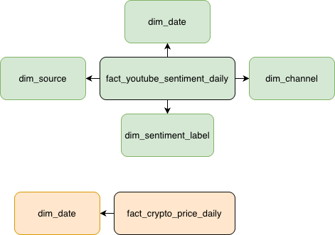

# Warehouse Design

## Overview

As the project evolved from a real-time cryptocurrency streaming pipeline into a broader analytics platform, a dedicated warehouse layer was introduced to support historical analysis, dimensional modelling, dashboard reporting, and analytical querying.

The original PostgreSQL database (`crypto_db`) functions primarily as an operational datastore for streaming ingestion and near real-time persistence. While this structure works well for transactional inserts and stream consumption, it is not optimised for analytical workloads or BI reporting.

To address this, a separate cloud-based PostgreSQL warehouse was implemented using Neon.

The warehouse layer enables:

- historical trend analysis
- dimensional modelling
- aggregated analytical queries
- dashboard optimisation
- separation of operational and analytical workloads
- scalable reporting architecture

The resulting architecture more closely resembles a simplified modern analytics platform with distinct operational and analytical layers.

---

## Architectural Separation: OLTP vs OLAP

### Operational Layer (OLTP)

The operational PostgreSQL database (`crypto_db`) is designed for transactional and streaming workloads.

Its primary responsibilities include:

- high-frequency ingestion
- intermediate persistence
- near real-time stream storage
- Kafka consumer outputs
- Spark processing outputs

Examples of operational tables include:

- `crypto_metrics`
- `historical_crypto_prices`
- `youtube_sentiment_metrics`
- `daily_youtube_sentiment_summary`

This layer prioritises ingestion speed and operational persistence rather than analytical querying.

---

### Analytical Warehouse Layer (OLAP)

The analytical warehouse layer is implemented using Neon PostgreSQL (`neondb`) and is designed specifically for historical analysis, dimensional modelling, and dashboard reporting.

Unlike the operational database, the warehouse is optimised for:

- read-heavy analytical workloads
- historical aggregation
- dashboard consumption
- dimensional querying

The warehouse layer stores transformed analytical data using a simplified star schema design composed of fact and dimension tables.

Examples of warehouse tables include:

- `fact_crypto_price_daily`
- `fact_youtube_sentiment_daily`
- `dim_date`
- `dim_channel`
- `dim_source`
- `dim_sentiment_label`

This separation between operational and analytical storage enables cleaner architecture and more scalable reporting workflows.

---

## Warehouse Architecture

The warehouse follows a simplified star schema design composed of fact and dimension tables.

This modelling approach was chosen to:

- simplify analytical querying
- improve dashboard performance
- separate measurable events from descriptive metadata
- reduce duplication
- support scalable historical analysis

The warehouse structure is intentionally designed for analytical consumption rather than transactional processing.

---

### Fact Tables

Fact tables store measurable business metrics and analytical events generated by the streaming pipelines.

#### fact_crypto_price_daily

Stores historical cryptocurrency market metrics aggregated by date and asset.

Metrics include:

- average price
- minimum price
- maximum price
- market capitalisation
- trading volume

Foreign keys:

- `date_id`

---

#### fact_youtube_sentiment_daily

Stores aggregated YouTube sentiment metrics grouped by publication date, source query, channel, and sentiment label.

Metrics include:

- comment count
- average sentiment score
- weighted sentiment score
- engagement score

Foreign keys:

- `date_id`
- `source_id`
- `channel_id`
- `sentiment_id`

---

### Dimension Tables

Dimension tables provide descriptive business context for analytical queries.

Separating dimensions from facts improves consistency, reduces duplication, and simplifies reporting logic.

---

#### dim_date

Provides reusable calendar attributes for time-series analysis.

Attributes include:

- full date
- year
- month
- quarter
- weekday

---

#### dim_source

Stores the original YouTube search query or topic context used during ingestion.

Examples include:

- Bitcoin
- Ethereum
- Solana

---

#### dim_channel

Stores YouTube channel metadata used for sentiment analysis.

---

#### dim_sentiment_label

Stores sentiment classification categories.

Examples include:

- positive
- neutral
- negative

---

### Warehouse Star Schema

---

### Warehouse Design Rationale

A dimensional warehouse design was chosen for several reasons:

- simplify BI dashboard development
- improve analytical query readability
- separate metrics from descriptive metadata
- reduce duplication across analytical tables
- support scalable historical analysis
- align with common analytics engineering practices

The resulting structure allows dashboards and analytical queries to operate against stable, business-oriented analytical models rather than raw streaming outputs.
